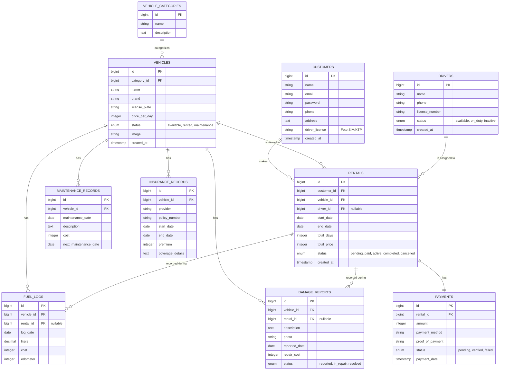

# Product Requirements Document (PRD): Sistem Rental Kendaraan

## 1. Ringkasan Eksekutif (Executive Summary)
**Sistem Rental Kendaraan** adalah platform aplikasi berbasis web yang membantu perusahaan rental mengelola armada kendaraan, pemesanan, pengemudi, hingga laporan kondisi kendaraan secara terpusat, efisien, dan transparan.

## 2. Masalah (Problem Statement)
Perusahaan rental membutuhkan sistem untuk mengelola armada kendaraan, pemesanan, pengemudi, dan laporan kondisi kendaraan — mulai dari katalog unit, penugasan pengemudi, konsumsi bahan bakar, jadwal perawatan, kerusakan, hingga status asuransi — yang saat ini masih dilakukan secara manual dan terpisah-pisah.

## 3. Tujuan & Sasaran (Goals & Objectives)
- **Bagi Pengelola Rental:** Mengotomatisasi manajemen armada kendaraan, penugasan pengemudi, pelacakan biaya operasional (BBM & perawatan), serta memonitor kondisi dan status legal (asuransi) kendaraan secara *real-time*.
- **Bagi Pengemudi:** Mendapatkan penugasan yang jelas dan mencatat kondisi kendaraan (BBM, kerusakan) selama masa tugas.
- **Bagi Pelanggan:** Memberikan kemudahan mencari kendaraan yang tersedia, melakukan pemesanan, dan membayar secara *online* kapan saja.

## 4. Target Pengguna (User Personas)
1. **Pengelola Rental (Admin):** Mengelola data kendaraan & kategori, menyetujui pemesanan, menugaskan pengemudi, memverifikasi pembayaran, mencatat perawatan/kerusakan/asuransi, dan melihat laporan.
2. **Pengemudi (Driver):** Menerima penugasan rental, mencatat konsumsi bahan bakar, dan melaporkan kerusakan kendaraan.
3. **Pelanggan (Customer):** Mencari kendaraan, membuat pesanan (rental), melakukan pembayaran, dan melihat riwayat pemesanan.

## 5. Fitur Utama (Key Features)

### A. Katalog Kendaraan dan Kategori
- CRUD Kategori Kendaraan (mis. City Car, SUV, MPV, Motor).
- CRUD Data Kendaraan (Nama, Merek, Nomor Polisi, Harga Sewa/Hari, Foto, Kategori).
- Manajemen Status Kendaraan (Tersedia, Disewa, Perawatan).

### B. Pemesanan dan Manajemen Rental
- Pencarian & filter kendaraan berdasarkan kategori dan tanggal ketersediaan.
- Proses pemesanan (pilih tanggal mulai & selesai, kalkulasi harga otomatis).
- Manajemen status rental (Menunggu Pembayaran, Dibayar, Berjalan, Selesai, Dibatalkan).

### C. Data Pengemudi dan Penugasan
- CRUD Data Pengemudi (Nama, No. SIM, Kontak, Status).
- Penugasan pengemudi ke transaksi rental tertentu.

### D. Pencatatan Konsumsi Bahan Bakar
- Input log BBM per kendaraan (tanggal, liter, biaya, odometer), terhubung ke rental terkait.

### E. Jadwal dan Riwayat Perawatan
- Pencatatan riwayat perawatan (servis, biaya, tanggal) per kendaraan.
- Penjadwalan perawatan berikutnya berdasarkan tanggal/jarak tempuh.

### F. Laporan Kerusakan Kendaraan
- Pelaporan kerusakan (deskripsi, foto, tanggal, estimasi/biaya perbaikan) terkait kendaraan & rental tertentu.
- Status penanganan kerusakan (Dilaporkan, Diperbaiki, Selesai).

### G. Manajemen Asuransi Kendaraan
- Pencatatan polis asuransi per kendaraan (penyedia, no. polisi, masa berlaku, premi, cakupan).
- Notifikasi masa berlaku asuransi akan habis.

### H. Pembayaran & Tagihan
- Pencatatan pembayaran per transaksi rental (metode, bukti transfer, status verifikasi).
- Penerbitan invoice otomatis.

### I. Dashboard & Laporan
- Ringkasan rental berjalan, total pendapatan, jumlah kendaraan aktif, dan status armada (tersedia/disewa/perawatan).

## 6. Skema Data & Arsitektur (Data Schema & Architecture)

### 6.1. Penjelasan Naratif
Sistem menggunakan arsitektur *Monolith* berbasis framework **Laravel**, dengan *frontend* menggunakan **Blade Template Engine** dan **Bootstrap (NiceAdmin)**. Database yang digunakan adalah **MySQL/PostgreSQL**.

Struktur data terdiri dari 10 tabel inti:
- **vehicle_categories:** Kategori/jenis kendaraan.
- **vehicles:** Katalog kendaraan, terhubung ke kategori.
- **customers:** Data pelanggan/penyewa.
- **drivers:** Data pengemudi.
- **rentals:** Tabel transaksi utama, menghubungkan `customers`, `vehicles`, dan `drivers` (opsional), mencatat periode & total tagihan.
- **fuel_logs:** Riwayat konsumsi bahan bakar per kendaraan, dapat terhubung ke `rentals`.
- **maintenance_records:** Riwayat & jadwal perawatan kendaraan.
- **damage_reports:** Laporan kerusakan kendaraan, terhubung ke `rentals` yang relevan.
- **payments:** Riwayat pembayaran untuk sebuah `rental`.
- **insurance_records:** Data polis asuransi per kendaraan.

### 6.2. Visualisasi ERD (Entity Relationship Diagram)

## 7. Kebutuhan Non-Fungsional (Non-Functional Requirements)
- **Keamanan:** Enkripsi password menggunakan Bcrypt, proteksi CSRF pada setiap form, dan pembatasan otorisasi level halaman dengan Middleware.
- **Kinerja:** Waktu muat halaman kurang dari 3 detik untuk sisi pelanggan.
- **Responsivitas:** Antarmuka harus beradaptasi dengan baik di perangkat seluler (Mobile-Friendly) menggunakan kaidah CSS framework yang ada.

> **Catatan:** Autentikasi Admin/Pengelola dapat ditangani melalui mekanisme login terpisah (mis. tabel `admins`/`users` internal Laravel) di luar 10 tabel inti di atas, karena fokus skema ini adalah entitas operasional rental.
